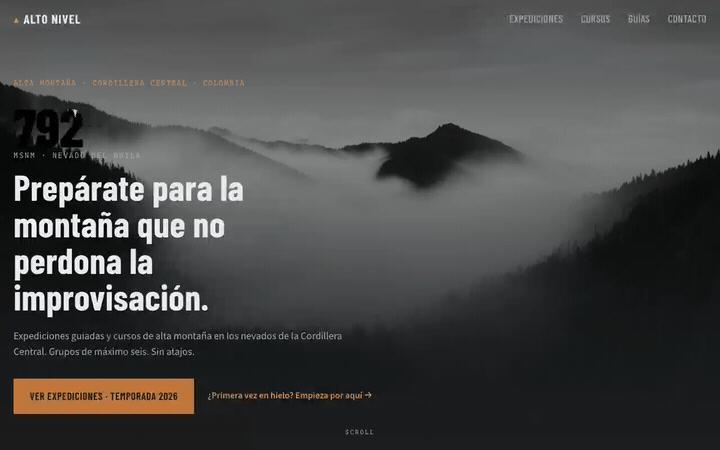
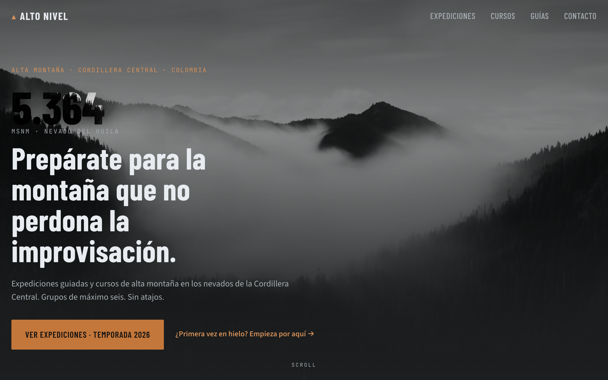
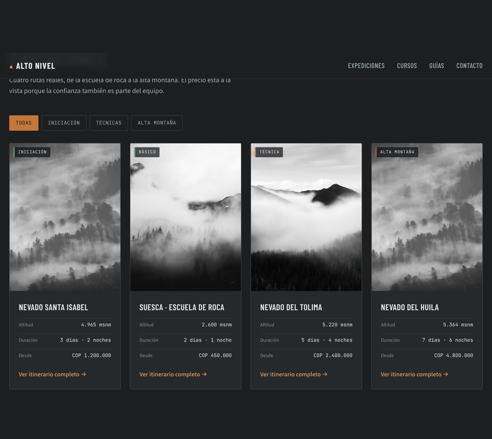
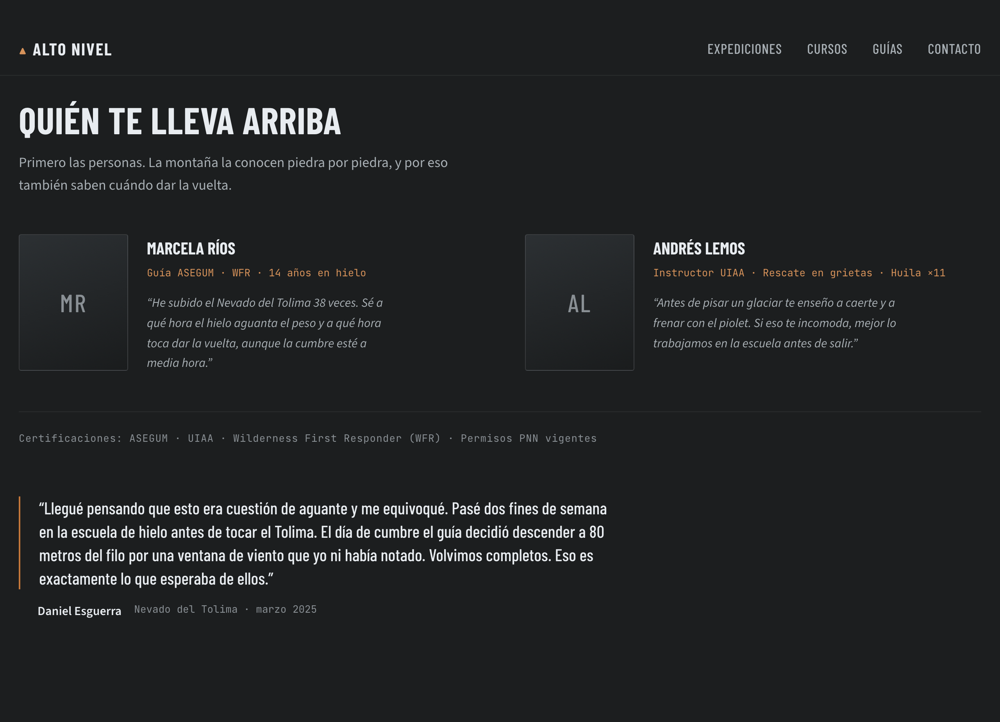
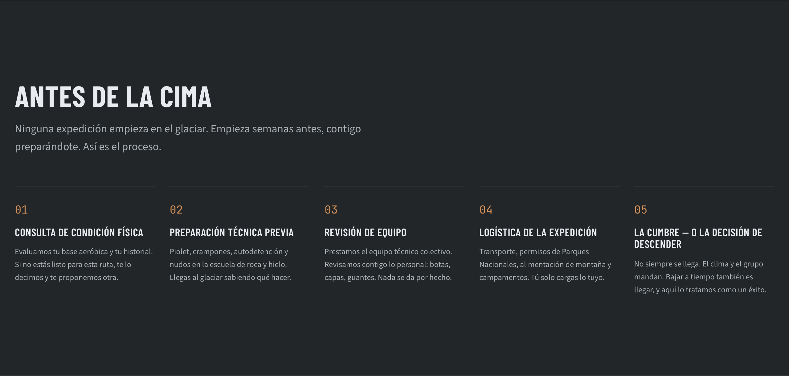
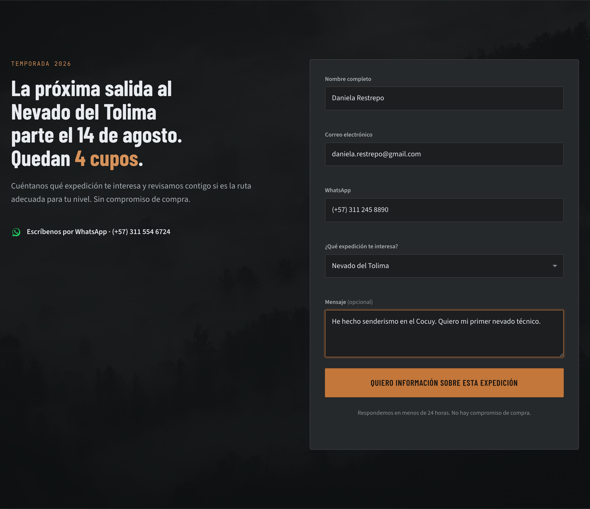
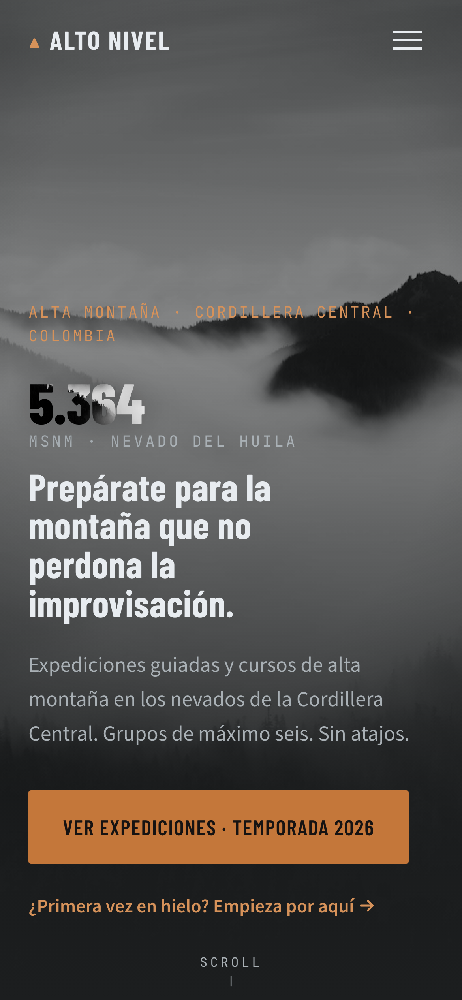
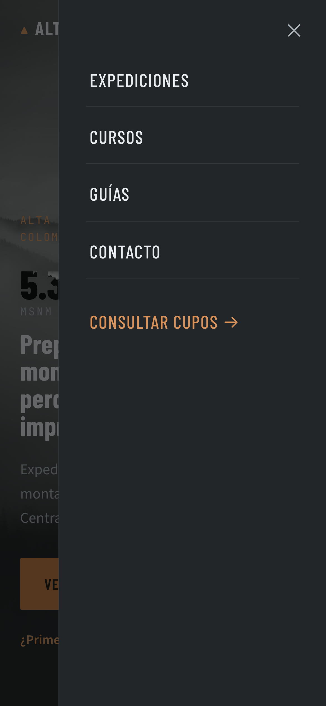
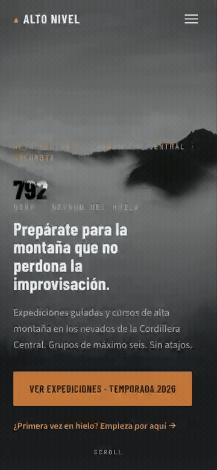

<div align="center">

# ▲ Alto Nivel

### Expediciones y cursos de alta montaña en los nevados de la Cordillera Central — para quien quiere subir bien preparado, no por turismo.

[](#)
[](#)
[](https://alto-nivel.netlify.app/)
[](#9-contribución--licencia)



</div>

---

## 2. El problema

Quien ya hace senderismo y quiere dar el salto a la alta montaña no sabe en quién confiar. El mercado está lleno de "turismo de aventura" que esconde el riesgo, minimiza la preparación y ni siquiera muestra el precio hasta el final. Resultado: gente que reserva sin entender a qué se enfrenta, o que nunca da el paso por desconfianza.

Aquí encuentras lo contrario: rutas reales con su dificultad, su altitud y su precio a la vista desde el primer segundo.

---

## 3. La solución

### Sabes exactamente a qué montaña te enfrentas


> **El dato más honesto es el héroe.** Lo primero que ves es una altitud real — 5.364 msnm — contando hasta su cima. No promete emoción: te pone la cifra que tendrás que ganarte. Desde aquí decides si esto es para ti.

### Eliges tu reto sin adivinar el precio


> Cada ruta dice su nivel (iniciación, técnica o alta montaña), cuánto dura y **cuánto cuesta, sin letra pequeña**. Desde aquí filtras por dificultad y comparas de un vistazo, sin escribirle a nadie para que "te pasen la info".

### Conoces a quién te lleva antes de pagar


> Ves a las personas reales que te guían, sus certificaciones y una frase suya — no un eslogan. El testimonio habla de la **preparación y de cuándo dar la vuelta**, que es lo que de verdad importa en la montaña.

### Entiendes el proceso antes de comprometerte


> Esto elimina el miedo al "¿y si no puedo?". Ves los cinco pasos —de la evaluación física a la cumbre— **incluyendo que a veces toca bajar, y que eso también es llegar**.

### Reservas en un toque, también desde el celular


> Dejas tus datos o escribes por WhatsApp con un toque. El sistema te valida cada campo mientras escribes y te confirma que **responderán en menos de 24 horas, sin compromiso de compra**.

### Pensado para el celular primero
La mayoría llega desde Instagram o WhatsApp: la experiencia móvil no es una reducción, es el escenario principal.

<table>
<tr>
<td width="50%"></td>
<td width="50%"></td>
</tr>
</table>

> El llamado a la acción cabe en el primer pantallazo y el menú se abre con un toque, con áreas grandes para el dedo. Nada de pellizcar para hacer zoom.

---

## 4. Flujos principales

### Cómo encontrar tu expedición


1. Entras y ves la altitud del Huila contando hasta su cima.
2. Bajas a **Expediciones**.
3. Tocas el filtro **Técnicas**.
4. La lista se reduce a las rutas de ese nivel.

**✅ Lo lograste cuando:** ves la ficha del Nevado del Tolima con su altitud (5.220 msnm), duración y precio.

### Cómo pedir información de una reserva


1. Vas a **Contacto**.
2. Escribes nombre, correo y WhatsApp (se validan al vuelo).
3. Eliges qué expedición te interesa.
4. Tocas **"Quiero información sobre esta expedición"**.

**✅ Lo lograste cuando:** aparece *"¡Gracias! Te contactaremos en menos de 24 horas."*

### Cómo navegar desde el celular


1. Tocas el ícono de menú.
2. El panel entra desde la derecha sobre la foto.
3. Tocas **Expediciones**.

**✅ Lo lograste cuando:** el menú se cierra y aterrizas en las expediciones.

---

## 5. Quick start

No necesitas instalar nada para verlo: es una página estática (HTML, CSS y JavaScript, sin frameworks).

**Requisitos:** un navegador. (Opcional: Node 18+ solo si quieres regenerar las capturas.)

```bash
git clone https://github.com/castellanosfelipe/Concept-Site-AltoNivel.git
cd Concept-Site-AltoNivel
python3 -m http.server 8000      # o simplemente abre index.html
```

Abre <http://localhost:8000>. **Sabes que funciona cuando** el titular muestra la cifra **5.364** contando hasta su cima y la navegación se vuelve sólida al bajar.

¿Quieres regenerar los screenshots y GIFs de este README?

```bash
npm install && npx playwright install chromium && npm run capture
```

---

## 7. Métricas de éxito del producto

Esta página tiene **una sola conversión**: que un visitante calificado deje sus datos o escriba por WhatsApp. Sabrás que está funcionando si se mueven estos números:

| Indicador | Qué te dice |
| --- | --- |
| **Solicitudes enviadas** (formulario + WhatsApp) | Demanda real de expediciones |
| **% que llega a Contacto** | Qué tan bien engancha el recorrido |
| **Calidad del lead** (nivel/experiencia en el mensaje) | Si el diseño está filtrando al visitante correcto |
| **Cupos llenados por salida** | El resultado de negocio final |

> El diseño está pensado para **filtrar**: el turista casual que busca "paseo fácil" se autoexcluye, y el montañista serio reconoce el vocabulario y se queda. Un lead menos pero mejor vale más que diez confundidos.

---

## 8. Roadmap

| Now | Next | Later |
| --- | --- | --- |
| Sustituir fotos placeholder por imágenes reales de expediciones | Conectar el formulario a Netlify Forms (captura real de leads) | Página de itinerario por expedición |
| Optimizar imágenes a WebP (carga < 2 MB en móvil) | Página de cada guía con su historial | Calendario de salidas con cupos en vivo |
| — | Versión en inglés para alpinistas extranjeros | Reseñas verificadas por expedición |

---

## 9. Contribución & licencia

¿Sugerencias o fotos reales de las rutas? Abre un *issue* o un *pull request*.

- **Código:** MIT.
- **Fotografías:** las imágenes actuales son *placeholder* de dirección de arte; cada `` lleva un comentario `ART DIRECTION` con la foto real que debe reemplazarla.

<div align="center">

**La montaña no se conquista. Se respeta y se vuelve.**

</div>
